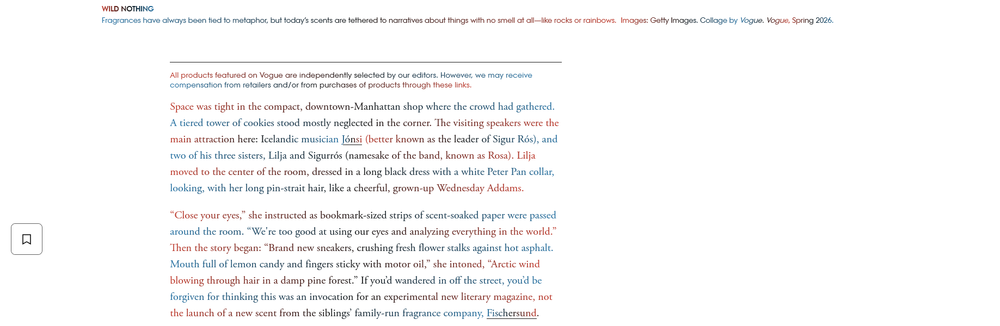

***degrade*** is a firefox extension implementation of dynamic text cross-line gradients as an accessibility reading aid, intended as a companion to [lectio](https://github.com/frutadoconde/lectio), but also perfectly usabe on it's own - *currently in beta*. 

due to being text node based, the current implementation works best with unbroken, paragraph separated text blocks; hyperlink and span-heavy pages like wikipedia don't display optimally, as each text node has it's own gradient.

the style injection itself aims to be as light and non-intrusive to the original code as possible. in my testing environment this has led to good performance, but i have not yet performed tests in other environments and setups, as this was originally meant to be a project exclusively for personal use, though i do aim to try to increase accessibility in future releases; the base functionality should work across most environments - regardless, use with caution.