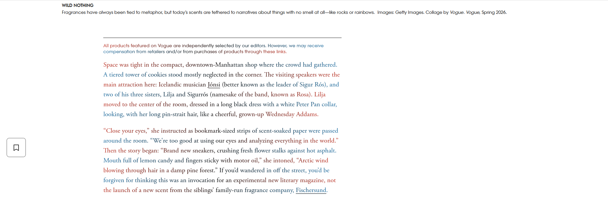

***degrade*** is a firefox extension implementation of dynamic text cross-line gradients as an accessibility reading aid, intended as a companion to [lectio](https://github.com/frutadoconde/lectio), but also perfectly usable on it's own - *currently in beta*.

the current implementation uses the GSAP library and it's SplitText plugin to handle line detection without relying on text node processing within the extension own code. this allows much better flexibility and a near guarantee of full-line rendering - thought for now it only works on text wrapped in HTML paragraph tags; this may change in the future.

this was originally meant to be a project exclusively for personal use, though i do aim to try to increase accessibility in future releases. i have not yet performed tests in a wider variety of environments; the base functionality should work across most - regardless, view this as an active work-in-progress.